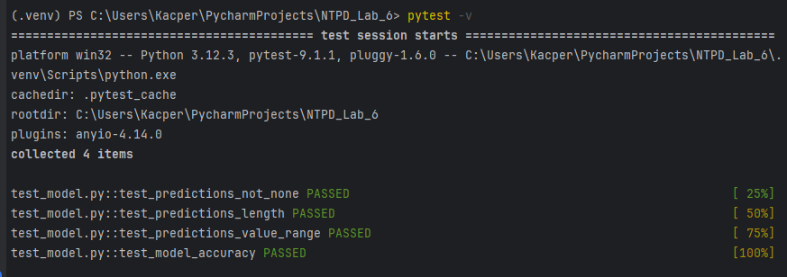
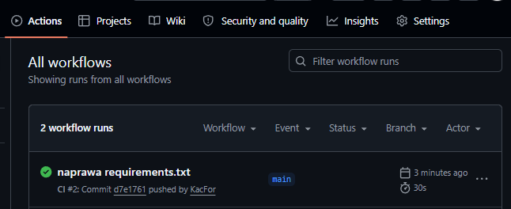
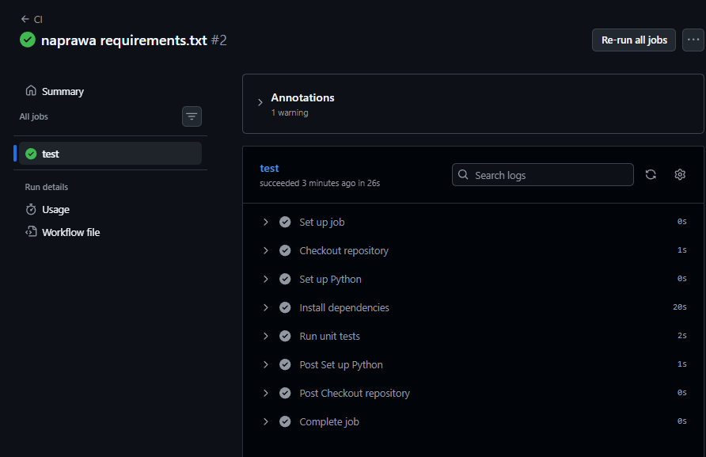

# NOWOCZESNE TECHNOLOGIE PRZETWARZANIA DANYCH - LAB06

Cel cwiczenia:  
Celem cwiczenia jest nabycie praktycznych umiejetnosci w zakresie tworzenia i weryfikacji prostego projektu ML z wykorzystaniem testow jednostkowych oraz narzedzi wspierajacych CI/CD.

---

## Zadanie 1: Przygotowanie repozytorium z przykladowym modelem ML

Repozytorium na GitHubie zawiera aplikacje API z poprzednich zajec (`app.py`) oraz modul `model.py` z funkcjami `train_and_predict()` i `get_accuracy()` wykorzystywanymi w testach jednostkowych.

W pliku `test_model.py` znajduja sie 4 testy jednostkowe napisane przy uzyciu biblioteki `pytest`:

| Test | Opis |
|---|---|
| `test_predictions_not_none` | Sprawdza, czy otrzymujemy jakakolwiek predykcje |
| `test_predictions_length` | Sprawdza, czy dlugosc listy predykcji jest wieksza od 0 i odpowiada liczbie probek testowych |
| `test_predictions_value_range` | Sprawdza, czy wartosci predykcji mieszcza sie w zakresie klas (0, 1, 2) |
| `test_model_accuracy` | Sprawdza, czy model osiaga co najmniej 70% dokladnosci |

Uruchomienie testow lokalnie:
```
pytest -v
```

Wynik lokalnego uruchomienia testow:



---

## Zadanie 2: Konfiguracja GitHub Actions do automatycznego testowania

W folderze `.github/workflows/` znajduje sie plik `ci.yml`, ktory definiuje workflow uruchamiany automatycznie przy kazdym `push` i `pull request` do galezi `main`. Workflow wykonuje nastepujace kroki:

1. Pobranie kodu repozytorium (`actions/checkout`)
2. Instalacja Pythona 3.11 (`actions/setup-python`)
3. Instalacja zaleznosci z pliku `requirements.txt`
4. Uruchomienie testow jednostkowych za pomoca `pytest`

Workflow w zakladce Actions na GitHubie:



Szczegoly poprawnego uruchomienia testow w workflow:



---

## Zadanie 3: Automatyczne budowanie obrazu Dockera (opcjonalne)

Repozytorium zawiera plik `Dockerfile` z poprzednich laboratoriow, ktory pozwala na zbudowanie obrazu Dockera z aplikacja. Workflow mozna rozszerzyc o dodatkowy job budujacy obraz i publikujacy go do GitHub Container Registry (`ghcr.io`) po pushu na galaz `main`.

---

## Wersjonowanie

| Wersja | Opis zmian |
|---|---|
| v1.0 | Pierwsza wersja z testami jednostkowymi i workflow CI |